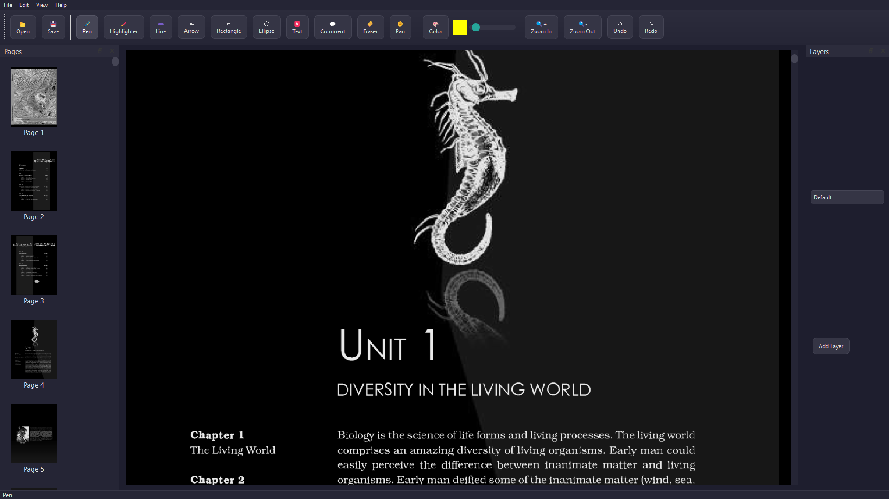

<!DOCTYPE html>
<html>
<head>
    <title>OpenPDF By Team Emogi</title>
</head>
<body>
    

        
    

    
<h1 align="center">OpenPDF By Team Emogi</h1>
    

        <b>A lightweight, fast, and modern PDF viewer/Editor built with Python and PyQt5</b>

    

    
 

        <!-- Logo Image -->
          <!-- Replace with your logo image -->
    

        
Download the latest version of OpenPDF:

        <a href="https://imimi328.github.io/OpenPDF/" class="button" target="_blank">
            <button style="padding: 10px 20px; font-size: 16px; color: white; background-color: #4CAF50; border: none; cursor: pointer;">
                Download OpenPDF
            </button>
        </a>
    

    

        <!-- Screenshot Image -->
          <!-- Replace with your app screenshot -->
    

<h2>✨ Features</h2>
<ul>
        <li>📄 Open, view, edit, write, and draw on any PDF document effortlessly</li>
        <li>🌙 Built-in <b>Dark Mode</b> for comfortable reading</li>
        <li>🖥️ Clean and minimalistic user interface</li>
        <li>⚡ Fast and optimized performance</li>
        <li>🔓 100% Open-source and free to use</li>
        <li>🛠️ Over <b>1000+ lines of structured, maintainable code</b></li>
        <li>🧬 Future updates with more features and enhancements planned!</li>
    </ul>

<h2>🚀 Installation</h2>
    
Clone the repository and run the app:

<pre>
        <code>
git clone https://github.com/Imimi328/OpenPDF.git
cd OpenPDF
pip install -r requirements.txt
python OpenPDF.py
        </code>
    </pre>

<h2>🤝 Contributing</h2>
    
We welcome contributions from developers, designers, and open-source enthusiasts!

 <ol>
        <li>Fork the repository</li>
        <li>Create your feature branch (<code>git checkout -b feature/AmazingFeature</code>)</li>
        <li>Commit your changes (<code>git commit -m 'Add some AmazingFeature'</code>)</li>
        <li>Push to the branch (<code>git push origin feature/AmazingFeature</code>)</li>
        <li>Open a Pull Request</li>
    </ol>

 

<h2>📄 License</h2>
    
This project is licensed under the <b>MIT License</b>.

    
See the <a href="LICENSE">LICENSE</a> file for more details.

 

        <i>Proudly crafted by Team Emogi. Together, we build the future!</i>
    

</body>
</html>
